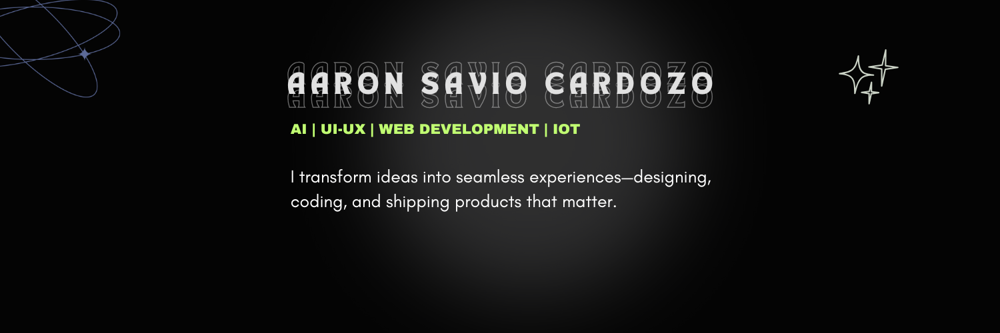

<h1 align="left">Hi,I'm Aaron </h1>

###

I’m Aaron Cardozo, a passionate UI/UX designer, web developer, and product builder who loves turning ideas into seamless digital experiences. Always exploring new tech, I focus on creating user-friendly solutions that solve real-world problems. 🚀

###

🚀 **What I Do:**  
- Design sleek and functional **UI/UX** experiences using **Figma & Photoshop**  
- Develop responsive websites with **Html,React, Next.js, Tailwind CSS, and Node.js**  
- Work in **Agile environments** and contribute to **real-world projects**  

💡 I love turning ideas into functional solutions and always look forward to collaborating on exciting projects!  
Let's connect and build something amazing! 🚀 

###

<h2 align="left">I code with</h2>

###

  
  
  
  
  
  
  
  
  
  
  
  
  
  
  
  
  
  
  
  
  
  
  

###
